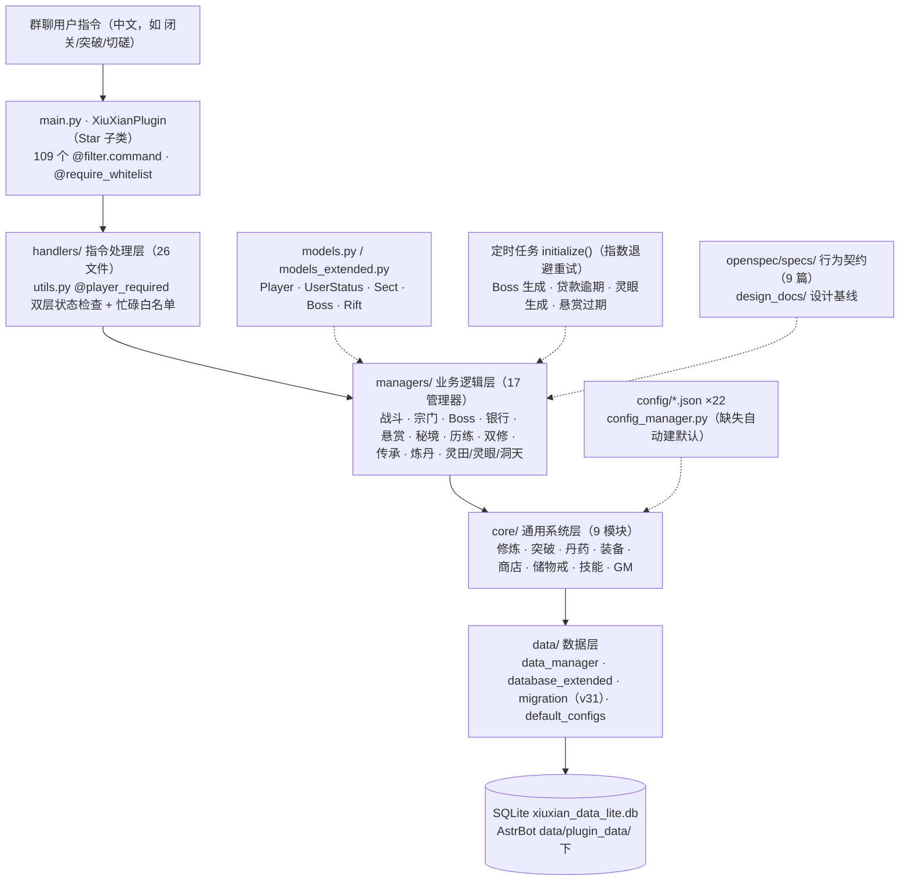

# 项目架构与系统功能设计总览

> 生成：2026-08-07；复核更新：2026-08-11（效果引擎 v2、新增 2 篇 spec、时间线与 bd 清单回写）；
> 2026-08-20（宗门变更 `add-default-sects-and-sect-growth` 回写：DB v31、指令 109、配置 ×22、spec 9 篇、时间线补 08-17/08-19 节点）。
> 本文是**本项目（AstrBot 修仙插件）**的架构与功能设计总览，
> 供开发者与 AI 助手在修改/新增功能时快速定位系统、理解设计意图、保持设计文档同步。
> 详细数值以 `current-design-report.md` 为准，行为契约以 `openspec/specs/` 为准。

---

## 1. 项目定位与运行形态

- **形态**：AstrBot 插件（群聊文字修仙游戏），运行于宿主 `~/code/AstrBot/`（uv 环境，Python ≥3.12）
- **入口**：`main.py` 的 `XiuXianPlugin`（`Star` 子类），AstrBot 插件加载器要求文件名必须是 main.py
- **依赖**：仅 `Pillow>=9.0.0`（requirements.txt，加载时自动安装）
- **数据**：SQLite（aiosqlite）`xiuxian_data_lite.db`，位于 `data/plugin_data/astrbot_plugin_monixiuxian2/`（AstrBot 数据目录，禁止写插件自身目录）；当前数据库版本 v31
- **配置**：静态 `config/*.json` ×22（`config_manager.py` 加载，改后重启生效）；动态 `_conf_schema.json`（WebUI 可调：白名单、GM/Boss 管理员、灵根、数值、数据库文件名）
- **测试**：pytest，`tests/helpers.py` 的 `load_module()` 绕过 managers/`__init__.py` 相对导入链

## 2. 分层架构

```
用户指令
  → main.py  @filter.command(CMD_XXX) 方法（109 个中文指令，@require_whitelist 内层）
  → handlers/  指令处理层（26 文件；utils.py 提供 @player_required 双层状态检查 + 忙碌白名单）
  → managers/  业务逻辑层（17 管理器：战斗/宗门/Boss/银行/悬赏/秘境/历练/双修/传承/炼丹/洞天/灵田/灵眼…）
  → core/      通用系统层（9 模块：修炼/突破/丹药/装备/商店/储物戒/技能/GM/…）
  → data/      数据层（data_manager.py 玩家 CRUD、database_extended.py 扩展 CRUD、
                      migration.py 版本化迁移、default_configs.py 内置默认配置）
  → models.py / models_extended.py（Player、UserStatus、Sect、Boss、Rift…）
```



**关键机制**（踩坑高发区）：

1. **状态双层维护**：`player.state`（字符串）与 `user_cd` 表 `type` 字段（`UserStatus` 枚举）必须同步；新增"进行中"状态要同时改 `models_extended.py`、`BUSY_STATE_ALLOWED_COMMANDS`（handlers/utils.py）、写入/清除 user_cd。
2. **事务保护**：并发敏感操作 `BEGIN IMMEDIATE` + commit/rollback；定时任务先 `ensure_connection()`。
3. **定时任务**（main.py `initialize()`，全部指数退避重试）：Boss 生成（boss.enabled）、贷款逾期检查、灵眼生成（7200s）、悬赏过期检查。
4. **广播**：`self.context.send_message({platform}:GroupMessage:{group_id}, chain)`；aiocqhttp 会 strip plain 消息首尾空白（用零宽空格保留）。
5. **消息发送**：普通 handler 用 `yield`，事件钩子（on_llm_request 等）用 `event.send()`。
6. **静态配置加载**：config_manager 自动从 `data/default_configs.py` 创建缺失 JSON。

## 3. 系统功能设计总览（22 个子系统）

> 括号内为入口/实现位置；关键数值为当前 config 默认值（以 `current-design-report.md` 为准）。

| 系统 | 入口 | 核心设计 |
|---|---|---|
| 闭关修炼 | 「闭关/出关」 | 开始记时间戳、出关结算（离线收益）；`exp = 100/min × 分钟 × 灵根倍率 × (1+心法) × 丹药`；上限 1440+360×大境界分钟；每满 2h 一次领悟判定 15%（需心法，限配套池+修习目标） |
| 突破 | 「突破」 | 成功率按大境界查表（练气100/筑基80/金丹65/元婴55/化神50/炼虚45/合体+40 地板）+ level_up_rate 永久加成 + 丹药，连败保底每败+5%、19 必成；失败死亡 uniform(0.5%,3%)×丹药倍率，死亡删号（回生丹复活减半）；未死惩罚 E(L)×25%；**方案A 成长**：hp+15 独立通道 + 5 点加权随机（伤害60/身法25/迅捷15） |
| 丹药 | 「炼丹/服用」 | 临时丹 60min tick；永久丹每境界增益 ≤ 该属性基础增量 30%；倍率乘区 `1+Σ临时+Σ永久`；重置丹返 50% 价；定魂丹免一次负面；回生丹复活 |
| 装备 | 「装备/卸下」 | 槽位=武器+防具+主心法+功法×4（max_technique_slots）；词条：四主属性 + base_damage/weapon_coefficient_k + armor_value + route_multiplier（路线倍率，乘属性词条与心法被动加成）+ trigger_skills + passive_bonus + skill_pool |
| 商店/储物戒 | 「商店/储物戒」 | 6h 刷新、折扣 0.8~1.2、权重加权不放回；储物戒 20 格、每物品占 1 格、丹药不可入 |
| 战斗引擎 | 「切磋/决斗/传承PK/历练/秘境/Boss」 | CombatEngine 统一结算：出手权=迅捷加权，行动上限 200；判定链=出手权→闪避→格挡→暴击→触发技→大招→伤害；伤害=floor((base_damage+伤害×K)×倍率×U(0.95,1.05))；护甲**百分比**减伤 `armor/(armor+100+10×L)`，总减伤 ≤40%；caps：闪避 0.4/格挡 0.3/暴击率 0.5/暴击倍率 1.5；战报按合并条数输出（默认 10） |
| 技能/领悟 | 「领悟/修习」 | 挂载制（无独立技能栏）；触发技引擎契约四键 `trigger_timing/effect_type/trigger_rate/effect_value`，EFFECT_HANDLERS 注册表分发 14 种效果键（13 个处理函数，combo 复用 damage_bonus 处理器；damage_bonus/combo/stun/counter/damage_reduction + heal/dot/buff/debuff/pierce/unavoidable/survive/reflect/fatigue），功法武器共用；持续状态机制：同名同源刷新、异源同型叠加上限默认 3 层（config 可调）、战斗结束全清（battle-status-effects spec）；大招**必放制**（注入 rate=1.0，config 不填概率）+ 解锁门槛（min_action_index + 血量阈值）；升星 3 星封顶、×(1.1)^(星级-1) 乘法、满星补偿 50% 修为；领悟池=配套池（系数加权）+修习目标+（仅突破）通用池 5%；**装备=已领悟表（player_skills）唯一依据**，储物戒秘籍仅作领悟凭据（物品名=技能名，商店 4011/4012 可购，掉落掉具体秘籍；旧 4001-4010 已 legacy 下架） |
| PvE 敌人 | 历练/秘境遭遇 | 过渡方案：level_data shim 合成 exp_needed 派生属性（damage≈exp//10、hp≈exp//2）× 模板系数（0.85/1.0/1.2）× 难度系数 ±10%；**待重做**：独立境界基准表（bd 9u2） |
| 世界 Boss | 「世界Boss」 | 8 档境界 hp_mult 1.0→6.0，数值同走 level_data 派生；Boss 会心 30%；败者安慰奖=经验×总伤害/max_hp；自动刷 base_exp=全服平均×1.2 |
| 宗门 | 「宗门」 | 创建 1万灵石+L3；捐献 1灵石→+1贡献+`scale_ratio`(10)建设度；建设任务从 sect_tasks.json 抽（cost/reward/cooldown 按任务配置）；**默认宗门**（sect_factions.json，启动幂等播种，加入校验境界段）；建筑：洞天全员闭关加成/丹房每日领丹（签到日重置）；镇派功法位全员被动；职阶晋升双门槛（贡献+境界，读 positions.promotion）+ 福利（签到俸禄/商店折扣/宝库 unlocks）；师承任务链（默认宗门专属，进度存 players.sect_master_progress）；离宗三路径回收 treasure 宝物、sect_bound 功法保留可用、绑定物禁赠；悬赏/秘境/历练/领悟池按宗门过滤注入；宗主死亡自动传位 |
| 银行/贷款 | 「银行」 | 存款复利 0.1%/日、上限 1000 万；普通贷 0.5%/7d、突破贷 0.8%/3d；还款单利；**逾期删号** |
| 悬赏 | 「悬赏」 | 难度解锁（hard L7/elite L12）；奖励=base×scale×(target/min)×(1+max(0,L-3)×0.06)；时限、70% 掉 1 件、放弃 1800s CD |
| 历练 | 「历练」 | 纯收益玩法（不受 pve 开关影响）；exp/gold 按分钟+等级加成+完成奖励×事件倍率；事件组 safe 1.1×/standard 1.2×/risky 0.7×+受伤；休整=疲劳 300s |
| 秘境 | 「秘境」 | 5 层预置（青云→上古遗迹）；1800s 探索；掉落按 drop_tables 权重；稀有丹 1/2/3 层 3%/5%/10% |
| 洞天福地 | 「洞天」 | 5 档（1万~100万灵石）；exp_bonus 5%~50%、灵石/时 100~1万；≥1h 可收、累计 24h 上限 |
| 灵田 | 「灵田」 | 开垦 1 万；5 作物（灵草 1h → 九叶灵芝 24h）；成熟 48h 枯萎；田地 5 级（3~20 格） |
| 灵眼 | 「灵眼」 | 7200s 生成；权重 50/30/15/5；产出 500/2000/8000/30000 修为/h；每人限 1 个 |
| 双修 | 「双修」 | 3600s 冷却、请求 300s 过期、修为差 ≤3 倍；**定额收益**=K(2)h×100×60×灵根×f(大境界)（不再按对方总修为） |
| 传承/传道 PK | 「传承」 | 传道 PK 累积 impart_value → 等阶阈值自动发奖励；PK 走统一引擎 |
| 炼丹 | 「炼丹」 | 成功率=min(95, 配方 50 + (L-要求)×2)；失败材料全损 |
| GM 工具 | 「修仙GM/修仙GM帮助」 | GM_ADMINS 独立权限；属性修改/给装备物品/卸装/清除CD（需确认）/强制结算/生成Boss；JSON 审计日志 500MB 滚动 |
| 内容同步管道 | scripts/sync_content_to_config.py | weapons/heart_methods/skills CSV→config（name 键控、契约校验、预算闸门） |

**排行榜**：战力 = 伤害 + 身法 + 迅捷 + 气血 + 护甲//2（含装备、不含临时丹；排行榜与玩家信息同公式）。

## 4. 核心设计契约（openspec/specs/）

| spec | 内容要点 |
|---|---|
| `attribute-numerics` | 四主属性（伤害/身法/迅捷/气血）；防御非主属性；十进制境界（99 级封顶）；属性=创角随机+突破随机成长（不从 exp/境界配置派生）；新战力公式；PvE 基准待重做；数值全部 config 化；旧五维直接废弃不映射 |
| `combat-core` | 全自动回合制；迅捷加权出手权+行动上限 200；Muxxu 伤害公式+护甲减伤；统一判定链（大招解锁门槛）；胜负/战报合并/统一结算入口；Boss/PvE 功能开关；触发效果分发契约（EFFECT_HANDLERS，未知 effect_type 告警跳过） |
| `skill-system` | 装备挂载制；引擎契约键名（无第二套同义键）；大招必放制+解锁门槛；功法槽位 4 本+升星 3 星乘法+满星补偿；领悟池三来源 |
| `level-progression` | 境界配置结构（realms+公式参数，无逐級字段）；get_level_name 统一入口；分段幂律曲线；成功率按大境界+连败保底+level_up_rate；失败惩罚 E(L)×25%；死亡率 [0.005,0.03]；双修定额；level_index 1-based |
| `content-sync-pipeline` | CSV→config 同步：name 键控合并、status 过滤、键名映射、引擎契约校验（大招禁 trigger_rate）、预算验算闸门 |
| `gm-commands` | 修仙GM 统一入口；GM_ADMINS 权限；目标解析优先级（@提及→数字 id→发送者）；属性修改/物品发放/强制结算/清除CD（需确认）/审计日志 500MB 滚动 |
| `battle-status-effects` | 战斗持续状态（dot/buff/debuff/fatigue）回合级生命周期：回合开始计数衰减、到期移除、战斗结束全清不跨场；同名同源刷新（数值取新）、异源同型叠加上限默认 3 层（config 可调） |
| `novel-reading-extraction` | 从修仙小说原文提取内容素材（宗门剧情/法宝/功法/突破事件）的工作流契约：免费可获取全文、来源失效可替换、按玩法维度组织、产出可直接喂给内容设定与文案 |
| `functional-test-suite` | 功能测试套件契约：用例源文件存 `functional_tests/cases/`（平台兼容 JSON）、`sync-cases` 拍平同步到网页测试平台、运行结果归档 `results/<YYYY-MM-DD>_<target>/`（summary+逐用例+轨迹）、PvP fixture 固定测试 ID 验内容效果 |

> ✅ **spec 滞后已回写（2026-08-07）**：attribute-numerics / combat-core 的护甲描述已改为
> 百分比减伤 `armor/(armor+K)`（与代码一致，bd `qtk` 的实现），含伤害下限场景修正。
> 注：`openspec/changes/archive/` 归档提案中的旧描述是历史快照，不代表现状。

## 5. 关键节点时间线（重设计以来的里程碑）

| 日期 | 节点 | 内容 |
|---|---|---|
| 2026-07-29 | `redesign-combat-skills` 变更（归档） | 战斗/属性重设计起步：Muxxu 伤害公式、四主属性框架立项 |
| 2026-07-30 | attribute-growth 调研 | 三游戏镜像战 TTK 蒙特卡洛模拟（41.6万场）+ 业界自动战斗平衡网络调研 → growth-balance-proposals（方案 A/B/C） |
| 2026-08-03 | `adjust-level-exp-curve` 变更（归档） | 经验曲线公式化（1800·L^1.5 分段幂律）、失败惩罚 E(L)×25%、成功率 40% 地板、双修定额化 |
| 2026-08-05 | `cleanup-legacy-fields-and-docs`（归档） | 遗留五维字段清理（bd gxo）、docs 整理 |
| 2026-08-06 | `skill-engine-fit-and-content-sync` 落地（08-07 归档） | 触发技键名统一（effect→effect_type）+ EFFECT_HANDLERS 注册表；大招必放制+解锁门槛；升星 3 星乘法+满星补偿；CSV→config 同步脚本；武器 v1（9 标杆+狼牙棒）/心法 v1（17）入库；契约测试（config→引擎真实路径） |
| 2026-08-06 | content-design 工作区建立 | weapons/skills/heart_methods CSV + validate_budget.py 验算 + researcher 外部调研整合（hz7 跟踪） |
| 2026-08-07 | `add-gm-commands` 归档 | GM 命令系统落地补归档；delta specs 全部同步至主 specs |
| 2026-08-07 | design_docs 同步治理 | README 标注资料归属（本项目/外部参考/混合）；本文档建立 |
| 2026-08-07 | specs 护甲回写 | attribute-numerics / combat-core 护甲描述由加法减伤改为百分比 `armor/(armor+K)`（bd qtk 实现回写，直接改主 spec，未走提案流程） |
| 2026-08-08 | `equip-from-learned-skills` 落地 | 装备唯一依据改为已领悟表（player_skills），储物戒秘籍仅作领悟凭据（单向机制，不可反向装备） |
| 2026-08-08 | v2 效果引擎化（bd tt3 关闭） | EFFECT_HANDLERS 扩至 14 键（13 个处理函数，combo 复用 damage_bonus）；持续状态机制 + 大招分发；新增 `battle-status-effects` spec |
| 2026-08-08 | content-design sync pipeline 落地 | CSV→config 同步实装（route_multiplier、心法路线校验）；ocr 评审后 reconcile 加固 |
| 2026-08-09 | 技能池 v2 扩展 | 12 个新效果族技能入库（content-design → config） |
| 2026-08-11 | `novel-reading-extraction` 归档 | 小说内容提取资料库建立 + spec 归档 |
| 2026-08-16 | `skill-budget-audit-and-heart-route-mult` 归档 | dhh 预算审计闭环（validate_budget 全 PASS）、心法被动 route_multiplier 落地（f4t 关闭）、v3.8.1 |
| 2026-08-17 | `add-functional-test-suite` / `fix-functional-test-bugs` 归档 | 功能测试套件落地（functional_tests/ 用例源+结果归档、sync/run/export 脚本）+ 配套 bug 修复 |
| 2026-08-19 | `add-web-test-platform` 归档 | 网页测试平台（独立插件仓库）：模拟私聊/群聊走真实管线、消息流可见可批注、热重载闭环 |
| 2026-08-19 | `add-default-sects-and-sect-growth` 落地 | 默认宗门（sect_factions.json 幂等播种、境界段拜入）+ 宗门成长（洞天/丹房/镇派功法/职阶晋升+福利/宝库/师承任务链）+ 离宗回收三路径与绑定物禁赠 + 悬赏/秘境/历练/领悟池宗门联动；DB v28-v31 |

**数据库迁移里程碑**：v22 四主属性重构（旧五维废弃不映射）→ v25 技能领悟持久化（player_skills 表）→ v26 传承重做（impart_value 等阶制）→ v27 方案A 成长模型+突破连败保底 → v28 默认宗门+功法归属（sects.is_system/faction_id、player_skills.sect_bound）→ v29 宝库领取记录 → v30 师承任务链进度 → v31 rifts 播种青云剑冢（id 6，宗门专属秘境，当前最新）。

## 6. 进行中的工作（bd open，设计相关）

| bd | 内容 | 与 design_docs 的关系 |
|---|---|---|
| `hz7` | 武器/功法/心法内容设计（照搬 MB/QPet 适配） | 主战场：`content-design/` 工作区 |
| `9u2` | Boss/PvE 模块重做（独立境界基准表落地 attribute-numerics PvE 需求） | 待玩家侧定稿后锚定 |
| `56y` | 固定收益类修为来源平衡（修为丹/商店/灵眼/福地/灵田/悬赏/秘境） | 依据 `level-exp-curve/balance-recommendations.md` |
| `cqt` | 突破保命道具设计（占位） | — |
| `cti` / `ehd` | 冻结平衡配置到 default_configs.py（两条同名，疑似重复建单，待去重） | 涉及 config 与 default_configs 的一致性 |

> 已闭环移出：`dhh`（功法数值配平，2026-08-16 审计通过）、`f4t`（心法 route_mult 机制，2026-08-16 落地），均见 change `skill-budget-audit-and-heart-route-mult`。

## 7. 设计资料导航与维护约定

- **归属**：`design_docs/README.md` 标注每项资料类型（本项目 / 外部参考 / 混合）；`mybrute/`、`qpet-daledou/` 为外部蓝本，不代表本项目现状。
- **权威顺序**：代码（实现事实） > `openspec/specs/`（行为契约） > `current-design-report.md`（数值基线） > 各工作区文档（进行中设计）。
- **同步义务**：任何影响玩法的修改（即使很小）必须同步 `design_docs/` 与 specs（插件根 `AGENTS.md` §14）；纯 bug 修复除外。
- **流程**：正式变更提案走 OpenSpec（`openspec/changes/` → 归档时同步 specs）；调研/演算/平衡资料进 `design_docs/`。
